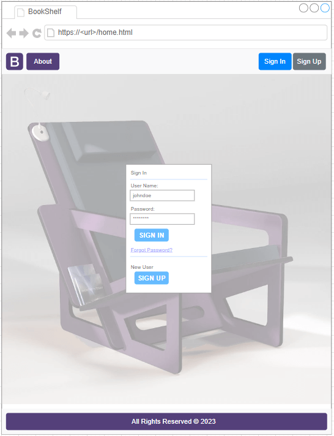
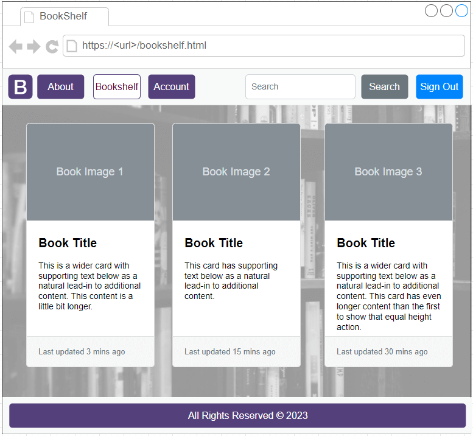
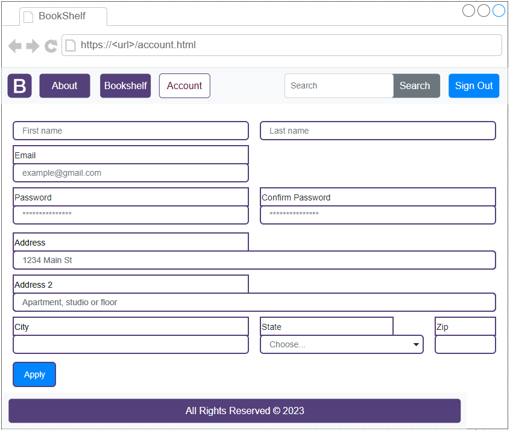
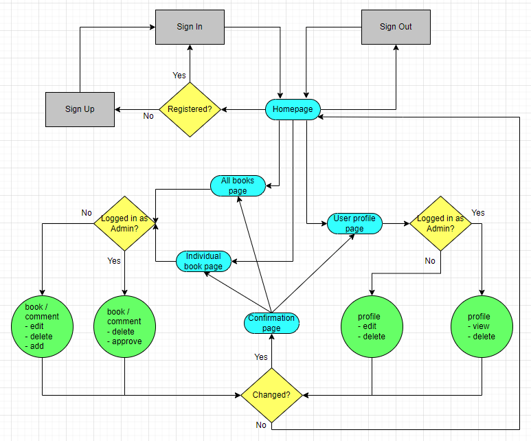
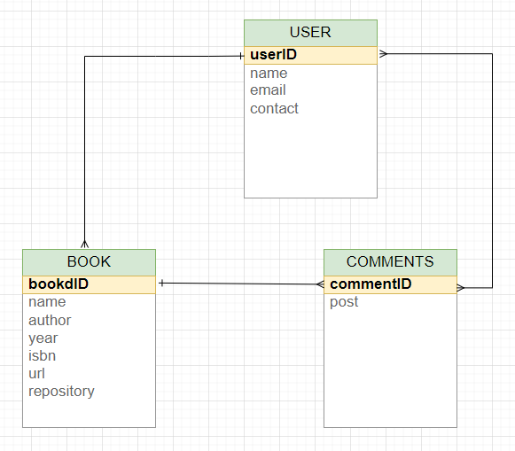
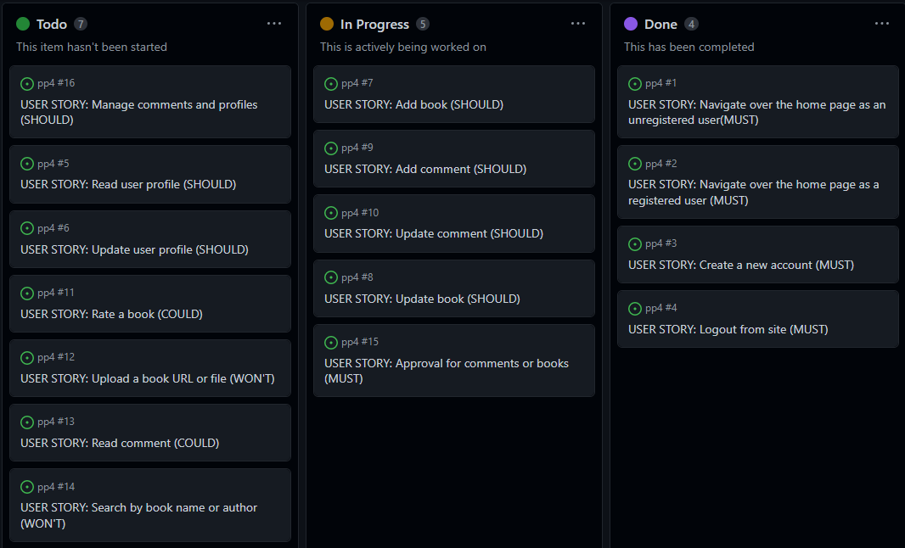

## Table of Contents
* [Purpose](#Purpose)
* [User Experience (UX)](#User-Experience-(UX))
    * [Site](#Site)
        * [Goals](#Goals)
        * [Design Wireframes](#Design-Wireframes)
        * [Logo](#Logo)
        * [Design Color-Scheme](#Design-Color-Scheme)
        * [Typography](#Typography)
        * [Structure (map)](#Structure-(map))
        * [Database (models)](#Database-(models))
    * [Features Left-to-Implement](#Features-Left-to-Implement)
* [Agile](#Agile)
    * [User Stories](#User-Stories)
* [Technologies](#Technologies)
    * [User Goals](#User-Goals)
* [Testing](#Testing)
    * [Test Results](#Test-Results)
        * [Validators](#Validators)
        * [Lighthouse](#Lighthouse)
    * [Testing Issues](#Testing-Issues)
* [Deployment to Heroku](#Deployment-to-Heroku)
    * [Creating a Django Project](#Creating-a-Django-Project)
    * [Creating an Heroku App](#Creating-an-Heroku-App)
    * [Setting Up Environment Variables](Setting-Up-Environment-Variables)
    * [Configuring "settings.py"](Configuring-"settings.py")
    * [Heroku Deployment](Heroku-Deployment)
    * [Final Deployment](Final-Deployment)
* [GitHub](#GitHub)
    * [Clone](#Clone)
    * [Fork](#Fork)
    * [Commands](#Commands)
* [Credits](#Credits)
    * [Content](#Content)
    * [Media](#Media)
    * [Acknowledgements](#Acknowledgements)

## Purpose
The idea behind this site is to provide a space where users can keep a track of their readings through a list of books.
Users should also be able to fill in with comments about any specifics of the book or just if they would or not recommend it to others.
Books may also be marked as like or unlike in order to create a ranking of the best books.
This app may be used as a personal bookshelf or a public blog where people can read anonymously the book references and ranking.
Future features should include a storage area where users may upload their (e)books and share them with others.
Another feature could be donations where users may register a book to be donated under some conditions.

The live website can be found [here](https://pp4-bookshelf.herokuapp.com/)

[Table-of-Contents](#Table-of-Contents)

## User Experience (UX)
### Site
#### Goals
* to allow users viewing their book listing or others
* to allow users creating , updating or deleting comments
* to find books according to their needs or interests
* to provide an admin privilege to approve, update or delete comments
#### Design Wireframes




#### Logo

#### Design Color-Scheme
* Predominant colours across all site are white and purple [54407A]
* Grey and grey ocasionaly.

#### Typography
**DynaPuff** (designed by Toshi Omagari, Jennifer Daniel) from Google fonts was used mostly for headers and logo title.
**Arial** (Helvetica, sans-serif) was used mostly for any other text in all sections, including the menu and form.
#### Structure (map)

#### Database (models)


### Features Left-to-Implement
* Repository for (e)books to be uploaded by registered users and sharing with other registered users 
* Donation for books where users may fill a form and then receive details on how to send the book (free of charges) to help local communities
* Search bar to find books by name or author

[Table-of-Contents](#Table-of-Contents)

### Agile
Agile methodology was used to plan this project and then through GitHub and Kanban board, the app deployment using MoSCoW prioritisation.

#### User Stories
A project called "bookshelf" was created using a single iteration with the following user stories.
* As a user I can see the navbar so that I can navigate over the homepage
* As a user I can sign in so that I can have access to full site contents
* As a new user I can register so that I have access to full site contents
* As a user I can sign out so that other users can navigate without using someone else credentials
* As a user I can add a book so that a books listing is available
* As a user I can add a comment so that books are rated
* As a user I can delete a book or comment so that the books listing is kept updated
* As a user I can create a profile so that the administrator knows more about the user
* As an admin I can edit or delete comments so that the book listing is kept under control
* As an admin I can approve comments so that the contents are kept under control
* As a user I can upload a book url so that a book can be accessible to others (sharing)
* As a user I can search a book so that access to other contents is made easier
* As a user I can like or unlike a book so that the book listing is rated (ranking)

[Table-of-Contents](#Table-of-Contents)

## Technologies
* Languages
    * Python
    * Bootstrap
    * Django
    * Cloudinary
    * Heroku
* Frameworks and other resources
    * HTML
    * CSS
    * JavaScript
    * Google fonts
    * Font Awesome
    * GitHub
    * GitPod
    * Git
    * Google Chrome Developer Tools
    * TinyPNG
    * Stackoverflow
    * W3schools

[Table-of-Contents](#Table-of-Contents)

## Testing
### Test-Results
#### Validators
* HTML - Official W3C validator [here](https://validator.w3.org/)
* CSS - Official (Jigsaw) validator [here](https://jigsaw.w3.org/css-validator/)
* Lighthouse – Developer Tools
* Chrome – Developer Tools
* Responsive Design [here](https://ui.dev/amiresponsive)
* Python - [here](https://pep8ci.herokuapp.com/#)
* Javascript - [here](https://jshint.com//)

#### Lighthouse


### Testing-Issues
* Bugs identified that need to be fixed.
    * 
    * 

[Table-of-Contents](#Table-of-Contents)

## Deployment to Heroku
### Creating a Django Project
* Install Django and gunicorn: `pip3 install django gunicorn`
* Install supporting database libraries dj_database_url and psycopg2 library: `pip install dj_database_url psycopg2`
* Install Cloudinary libraries to manage static files: `pip install dj-3-cloudinary-storage`
* Create file for requirements: `pip freeze --local > requirements.txt`
* Create project:`django-admin startproject project_name .`
* Create app: `python manage.py startapp app_name`
* Add app to list of `installed apps` in settings.py file: `'app_name'`
* Migrate changes: `python manage.py migrate`
* Test server works locally: `python manage.py runserver`

### Creating an Heroku App
* Navigate to the Heroku website
* Create a Heroku account
* Activate the account
* Click the **new button** on the top right corner of the screen and select create a new app
* Enter a unique name for the application
* Select the appropriate region for the application
* Click create app
* In the Heroku dashboard click on the Resources tab
* Scroll down to Add-Ons, search for and select 'Heroku Postgres'
* In the Settings tab, scroll down to 'Reveal Config Vars' and copy the text in the box beside DATABASE_URL

### Setting Up Environment Variables
* Create a new env.py file
* Add env.py to the .gitignore file
* In env.py import the os library
* In env.py add `os.environ["DATABASE_URL"]` = "copy link from Heroku DATABASE_URL"
* In env.py add `os.environ["SECRET_KEY"] = "generate a random secret key"`
* In Heroku Settings tab Config Vars enter the same secret key created in env.py

### Configuring "settings.py"
* In your Django 'settings.py' file type:

 ```
 from pathlib import Path
 import os
 import dj_database_url

 if os.path.isfile("env.py"):
  import env
 ```
* Remove the default insecure secret key in settings.py and replace with the link to the secret key variable in Heroku
* Comment out the `DATABASES` section in settings.py and replace
```
DATABASES = {
  'default': 
  dj_database_url.parse(os.environ.get("DATABASE_URL"))
  }`
```
* Create a Cloudinary account and from the 'Dashboard' in Cloudinary copy your url into the env.py file
* In Heroku  add cloudinary url to 'config vars'
* In Heroku config vars add DISABLE_COLLECTSTATIC with value of '1'
* Add Cloudinary libraries to the installed apps section of settings.py
 ```
 'cloudinary_storage'
 'django.contrib.staticfiles''
 'cloudinary'
 ```
* Connect Cloudinary to the Django app in `settings.py`
```
STATIC_URL = '/static'
STATICFILES_STORAGE = 'cloudinary_storage.storage.StaticHashedCloudinaryStorage'
STATICFILES_DIRS = [os.path.join(BASE_DIR, 'STATIC')]
STATIC_ROOT = os.path.join(BASE_DIR, 'staticfiles')
MEDIA_URL = '/media/'
DEFAULT_FILE_STORAGE =
'cloudinary_storage.storage.MediaCloudinaryStorage'
* Link file to the templates directory in Heroku 
* Place under the BASE_DIR: TEMPLATES_DIR = os.path.join(BASE_DIR,
'templates')
```
* Change the templates directory to TEMPLATES_DIR. Place within the TEMPLATES array: `'DIRS': [TEMPLATES_DIR]`
* Add Heroku Hostname to ALLOWED_HOSTS: ```ALLOWED_HOSTS =
['rhi-book-nook.herokuapp.com', 'localhost']```
*Create Procfile at the top level of the file structure and insert the following:
    ``` web: gunicorn PROJECT_NAME.wsgi ```

* Make an initial commit and push the code to the GitHub Repository
    ```git add .```
    ```git commit -m "Initial deployment"```
    ```git push```

### Heroku Deployment
* Click Deploy tab in Heroku
* In the 'Deployment method' section select 'Github' and click the 'connect to Github' button to confirm
* In the 'search' box enter the Github repository name for the project
* Click search and then click connect to link the heroku app with the Github repository. The box will confirm that heroku is connected to the repository

### Final Deployment
* When development is complete change the debug setting to: `DEBUG = False` in `settings.py` 
* In Heroku settings config vars change the DISABLE_COLLECTSTATIC value to '0'
* Because DEBUG must be switched to True for development and False for production it is recommended that only manual deployment is used in Heroku 
* To manually deploy click the button 'Deploy Branch'. The default 'main' option in the dropdown menu should be selected in both cases. 
When the app is deployed a message 'Your app was successfully deployed' will be shown. Click 'view' to see the deployed app in the browser.

## GitHub
### To clone the repository
1. Click on the code button which is underneath the main tab and repository name to the right.
2. In the 'Clone with HTTPS' section, click on the clipboard icon to copy the URL.
3. Open Git Bash in your IDE of choice.
4. Change the current working directory to where you want the cloned directory to be made.
5. Type git clone, and then paste the URL copied from GitHub.
6. Press enter and the clone of your repository will be created.

### Fork the repository
Most commonly, forks are used to either propose changes to someone else's project to which you do not have write access, or to use someone else's project as a starting point for your own idea. You can fork a repository to create a copy of the repository and make changes without affecting the upstream repository.
So a fork is a copy of a repository. Forking a repository allows you to freely experiment with changes without affecting the original project.
1. Navigate to the GitHub Repository you want to fork.
1. On the top right of the page under the header, click the fork button.
1. Create a new fork.
1. This will create a duplicate of the full project in your GitHub Repository.

### Commands
* `CTRL + S` was used to save the page.
* `CTRL + Z` was used to undo a change.
* `python3 -m http.server` was used to view and test site before pushing live.
* `git add` was used to add pages to the stage area.
* `git commit -m "fix: message here"` was used to comit them them to github and provide a relevant message to the changes that had been made.
* `git push` was used to push the changes upto Github for public viewing.

[Table-of-Contents](#Table-of-Contents)

## Credits
### Content
* Guidance for this project was gathered from CI modules FST (Hello Django & I Think Therefore I Blog) and Bootstrap (Putting It All together)

### Media
* The photos used in this website were taken from some resources such as the below.
    * Pexels.com - used for images
    * Unsplash.com - used for images
    * Google.com - used for images

### Acknowledgements
* Huge thank you to my mentor **Ronan McClelland** for his guidance throughout my project.

[Table-of-Contents](#Table-of-Contents)